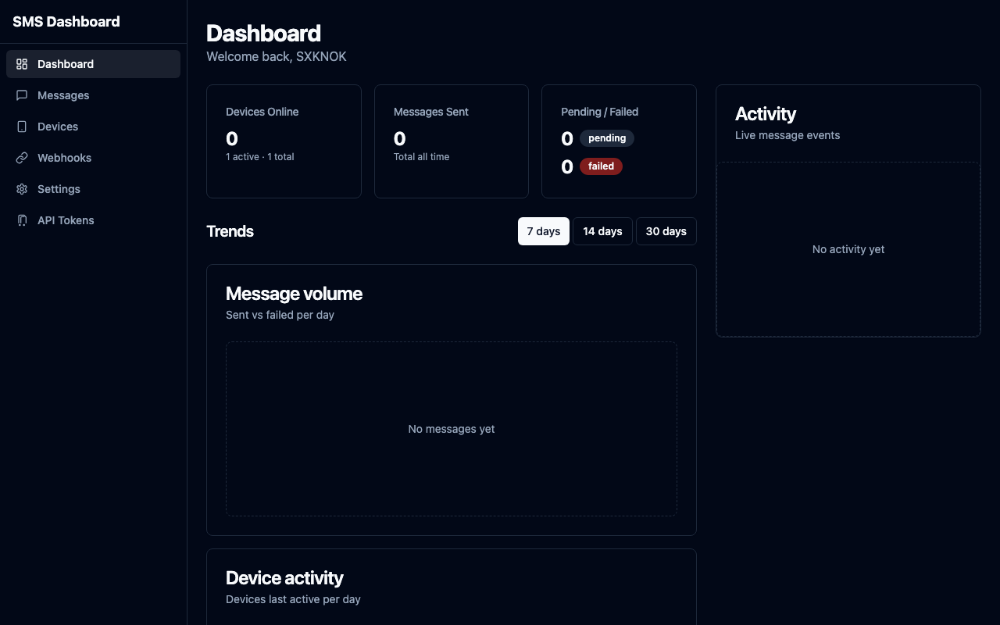
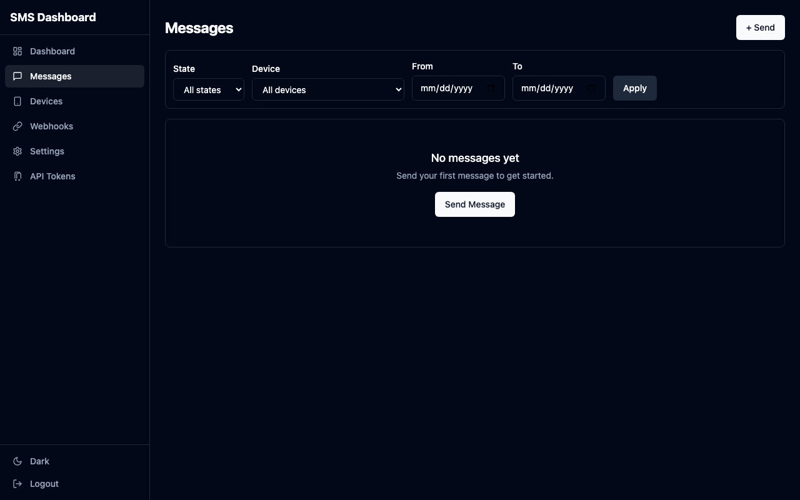
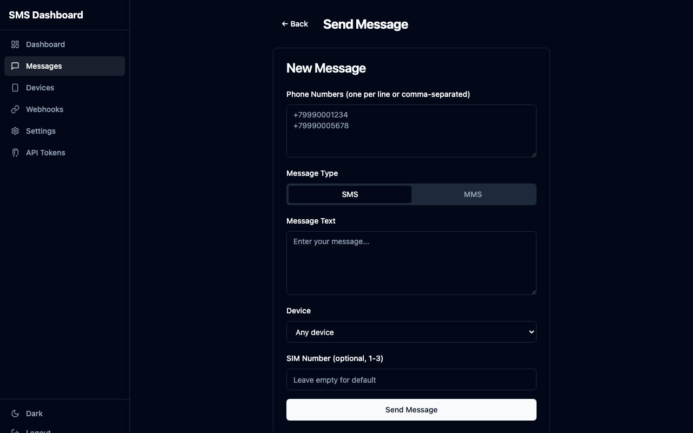
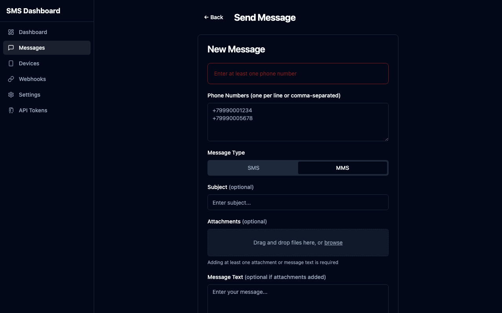
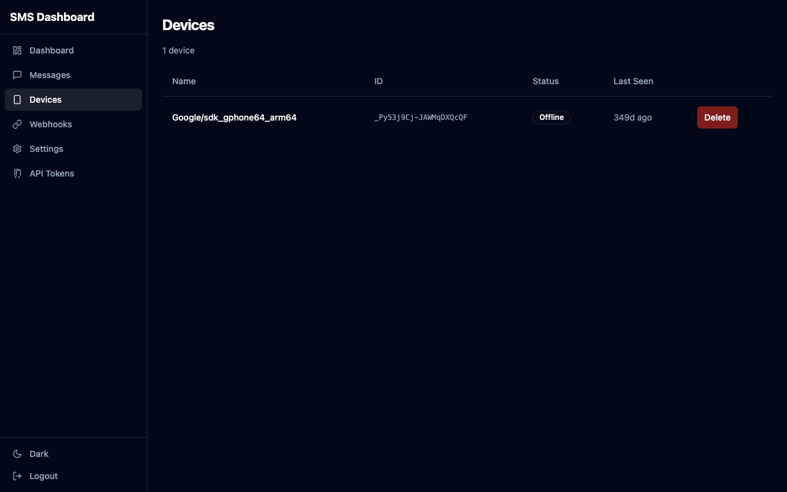
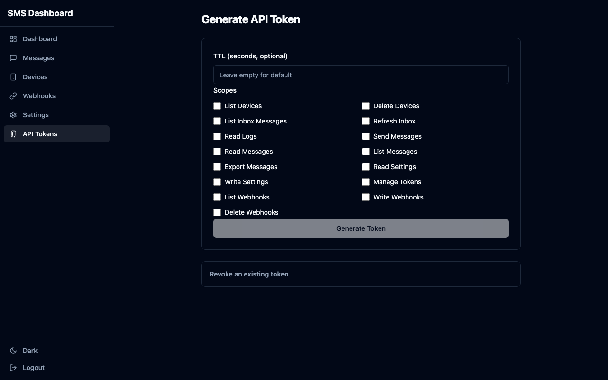
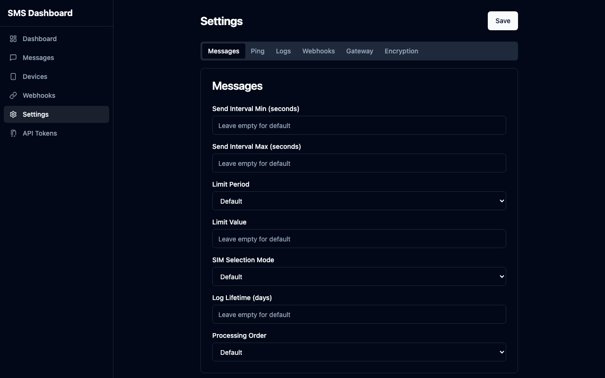
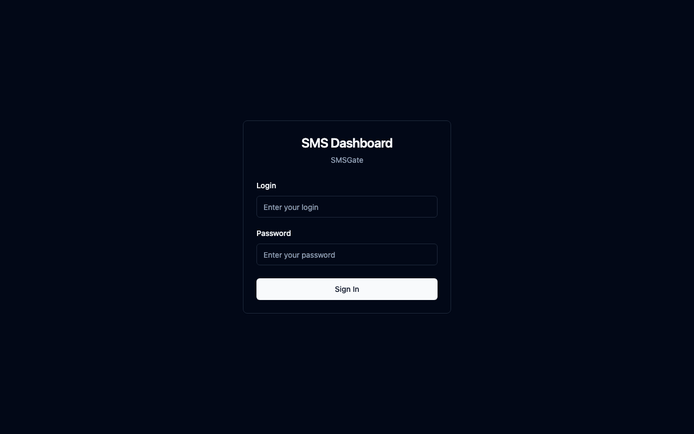

# 🖥️ SMSGate Web Dashboard

[![Contributors][contributors-shield]][contributors-url]
[![Forks][forks-shield]][forks-url]
[![Stars][stars-shield]][stars-url]
[![Issues][issues-shield]][issues-url]
[![License][license-shield]][license-url]

A standalone Go HTTP server with an embedded SvelteKit single-page application: a web dashboard for managing Android devices running SMS Gateway for Android. Part of the [SMSGate ecosystem](https://sms-gate.app).

## 📖 About

The dashboard proxies the [SMSGate 3rd Party API](https://docs.sms-gate.app/integration/api/): it validates credentials, keeps cookie-backed server sessions, registers webhooks per session, and pushes real-time events to the browser over Server-Sent Events. The Svelte 5 frontend is compiled to static files and embedded in the Go binary via `embed.FS`.

## 📚 Table of Contents

- [🖥️ SMSGate Web Dashboard](#️-smsgate-web-dashboard)
  - [📖 About](#-about)
  - [📚 Table of Contents](#-table-of-contents)
  - [⭐ Features](#-features)
  - [📸 Screenshots](#-screenshots)
  - [📦 Prerequisites](#-prerequisites)
  - [🚀 Quickstart](#-quickstart)
    - [Environment Variables](#environment-variables)
  - [🚀 Build and Deploy](#-build-and-deploy)
  - [📚 Documentation](#-documentation)
  - [🤝 Contributing](#-contributing)
  - [⚖️ License](#️-license)

## ⭐ Features

- Dashboard: aggregated statistics (devices online/active/total, messages sent/pending/failed), 7/14/30-day trend charts, live activity feed
- Messages: paginated list with filters (state, device, date range), send SMS or MMS with attachments, optionally target a specific device, delivery status timeline
- Devices: list with online/offline status, remove devices
- Webhooks: create, list, and delete subscriptions for all SMS event types (received, sent, delivered, failed, MMS, data SMS, ping)
- API tokens: generate JWT tokens with granular scope selection (15 permission levels), copy and revoke
- Device settings: SIM selection mode, message intervals, retry policy, webhook signing key, encryption passphrase
- Real-time: live SSE stream with toast notifications for messages, state changes, and device status
- Observability: OpenAPI/Swagger UI at `/api/v1/docs`, Prometheus metrics at `/metrics`

## 📸 Screenshots

|                                             |                                             |
| ------------------------------------------- | ------------------------------------------- |
|      |        |
|  |  |
|          |            |
|        |              |

## 📦 Prerequisites

- Go 1.25+
- Node.js 20+ (frontend build)
- Optional: [air](https://github.com/air-verse/air) for live reload (`go install github.com/air-verse/air@latest`), `golangci-lint`

## 🚀 Quickstart

```bash
git clone https://github.com/android-sms-gateway/web-dashboard.git
cd web-dashboard
make deps
make air
```

Open http://localhost:3000. `make air` runs `go generate` first (installs npm dependencies, compiles and embeds the Svelte frontend), then starts the Go server with hot reload on `.go` changes.

For standalone frontend work, the Vite dev server proxies `/api` to the Go server:

```bash
cd web
npm ci
npm run dev
```

Vite serves the SPA at http://localhost:5173.

### Environment Variables

Configuration is read from environment variables, an optional `.env` file in the working directory, or an optional YAML file (`CONFIG_PATH`). Env vars use `__` as the section separator and override file-based values.

| Variable        | Default                                       | Description                                                                                                                                                   |
| --------------- | --------------------------------------------- | ------------------------------------------------------------------------------------------------------------------------------------------------------------- |
| `HTTP__ADDRESS` | `127.0.0.1:3000`                              | HTTP server bind address                                                                                                                                      |
| `GATEWAY__URL`  | `https://api.sms-gate.app/3rdparty/v1`        | SMSGate 3rd Party API endpoint                                                                                                                                |
| `WEBHOOKS__URL` | `http://localhost:3000/api/webhooks/callback` | Callback URL for webhook events (localhost default is for local or colocated gateway deployments; remote deployments must use a publicly reachable HTTPS URL) |
| `CACHE__URL`    | `memory://`                                   | Trends cache backend (`memory://` or `redis://`)                                                                                                              |
| `CONFIG_PATH`   | -                                             | Path to optional YAML configuration file                                                                                                                      |

See [.env.example](.env.example) for the full list, including proxy and OpenAPI settings.

## 🚀 Build and Deploy

Build the production binary (OpenAPI docs + embedded frontend):

```bash
make build
```

Docker images (`linux/amd64` and `linux/arm64`, Alpine-based, non-root user) are published to GitHub Container Registry:

```bash
docker run --name web-dashboard \
  -p 3000:3000 \
  -e HTTP__ADDRESS=0.0.0.0:3000 \
  -e WEBHOOKS__URL=https://your-public-url/api/webhooks/callback \
  ghcr.io/android-sms-gateway/web-dashboard:latest
```

## 📚 Documentation

- [Central docs](https://docs.sms-gate.app/)
- [GitHub repository](https://github.com/android-sms-gateway/web-dashboard)

## 🤝 Contributing

Contributions are welcome. Open an issue or pull request; follow the [Contributing Guide](https://docs.sms-gate.app/contributing/) and the repo's `make fmt` / `make lint` / `make test` checks.

## ⚖️ License

Apache-2.0. See [LICENSE](LICENSE).

<!-- Reference-style badge URLs: style=for-the-badge is mandatory -->
[contributors-shield]: https://img.shields.io/github/contributors/android-sms-gateway/web-dashboard?style=for-the-badge
[contributors-url]: https://github.com/android-sms-gateway/web-dashboard/graphs/contributors
[forks-shield]: https://img.shields.io/github/forks/android-sms-gateway/web-dashboard?style=for-the-badge
[forks-url]: https://github.com/android-sms-gateway/web-dashboard/network/members
[stars-shield]: https://img.shields.io/github/stars/android-sms-gateway/web-dashboard?style=for-the-badge
[stars-url]: https://github.com/android-sms-gateway/web-dashboard/stargazers
[issues-shield]: https://img.shields.io/github/issues/android-sms-gateway/web-dashboard?style=for-the-badge
[issues-url]: https://github.com/android-sms-gateway/web-dashboard/issues
[license-shield]: https://img.shields.io/github/license/android-sms-gateway/web-dashboard?style=for-the-badge
[license-url]: https://github.com/android-sms-gateway/web-dashboard/blob/master/LICENSE
